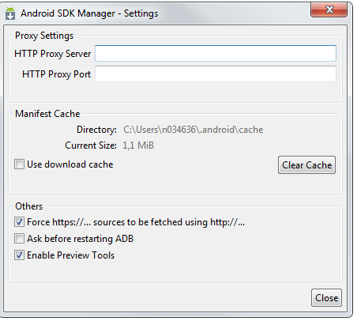
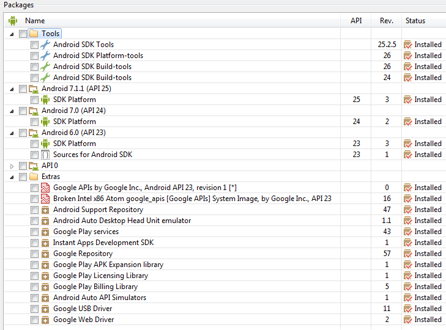

# Push Notification Test APP

## Introduction

TODO

This is a hybrid application developed using Cordova. To undestand what Cordova is take a look to this little [tutorial](https://expocodetech.com/apache-cordova-primeros-pasos/) 

## Change Log

**Version 1.0.0**

Initial version.

## Local Development

### All Platforms

You will need several tools installed in your working machine. Follow this notes to setup your development environment.

First, install [Node.js](https://nodejs.org/es/download/) as portable version. LTS is recommended.

Include the next environment variables to get access internet using the command shell (Windows)

HTTP_PROXY=http://[user]:[pwd]@[proxy]:[port]

HTTPS_PROXY=http://[user]:[pwd]@[proxy]:[port]

Then install/update the npm package manager: npm install npm -g.

Follows with the installation of Cordova: npm install -g cordova.

### Android

You will need the SDK Android to build the app for Android platform. To get the SDK you need to install the [Android Studio](https://developer.android.com/studio/index.html).

Then, configure SDK Manager options (Tools/Options...)

access to SDK Manager and check if you have all required dependencies

install/update necessary packages (as showed in previous image).

Set next environment variables to indicate Cordova where is the SDK Android, JDK and configure JAVA options to get access to internet.

ANDROID_HOME=[path of SDK Android]. For instance: C:\Users\user\AppData\Local\Android\sdk1

JAVA_HOME=[path of Java JDK]. For instance: C:\Program Files\Java\RedHat\java-1.8.0-openjdk-1.8.0.111-3

JAVA_OPTS=-Dhttp.proxyHost=[proxy] -Dhttp.proxyPort=[port] -Dhttp.proxyUser=[user] -Dhttp.proxyPassword=[password] -Dhttps.proxyHost=[proxy] -Dhttps.proxyPort=[port] -Dhttps.proxyUser=[user] -Dhttps.proxyPassword=[password] -Dmaven.wagon.http.ssl.insecure=true -Dmaven.wagon.http.ssl.allowall=true

Install gradle: https://gradle.org/install/

Set enviroment variables 

GRADLE_HOME=[path gradle]. For instance: C:\Gradle\gradle-4.1

include in PATH environment variable the path where the gradle execute file is

PATH=[PATH];C:\Gradle\gradle-4.1\bin

Clone this repository in a working directory. Then you need the file google-services.json (you can get it from [Firebase Console Development](https://console.firebase.google.com/project/......)). Copy the file in root project directory.

Inside file app.js you have to fix the values for the variables *senderID* and *securityCredentials*.

senderID is the identifier of the project in [Firebase Console Development](https://console.firebase.google.com/project/......) you can find this value.

securityCredentials is the data that the SecurityService needs to get access tokens. This variable is equals to Base64(consumer-key:consumer-secret) where consumer-key and
consumer-secret are values provided by the API Manager that publish the Push public API.

#### Build
cordova platform add android

cordova build android

#### Run
cordova run android

NOTE: You need a real device connected to your working machine.

## Other commands and utilities

cordova emulate android. Launch the app inside virtual device.

NOTE: You need a virtual device connected to your working machine.

Take a look to AVD Manager
[SDK Android path]\AVD Manager.exe

[SDK Android path]\platform-tools\adb devices. List all connected devices to the working machine.

[SDK Android path]\tools\monitor.bat. Get access to app monitor. You will need this monitor for development and debugging tasks.

## More documentation

[Technical doc](./docs/technical/technical_documentation.adoc)

[User Guide](./docs/user/user_guide.adoc)