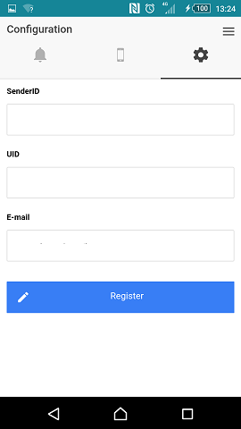
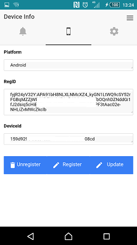
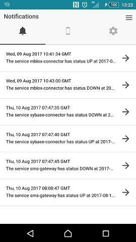
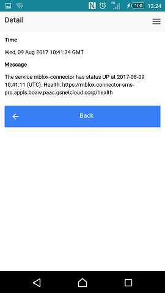

= * Health Collector APP - User Guide *
 <SaaS Team>
:toc:

== Introduction

The health collector service runs periodically health checks over a group of services. The system extract the current health and saves inside a storage.
If a services changes its status then an alarm is triggered. There are several channels to be used in sending alarms (sms, push). This hybrid app can receive
the push notifications sent by the collector service.

== Initial setup

First you need to configure the application to receive your push notification alarms.

Start the application and go to the Configuration link and fix the fields for **uid** an **email** (values must be in lower case). The uid is your current user 
to get access to the resources inside the organization (normally your employee id). Don´t change the value for the SenderID field.

 

Push in the register button.

Close the application and start again. The registration process will be executed.

If all is ok then you will have fixed all values in Device Info view.

 

== Features

===  Device Info

In device information view you can get access to information about your registration inside the external Push notification provider and inside the internal Push notification
platform.

 

**Platform:** Platform where this device is registered. Example: Android.

**RegID:** The id of the device in the external provider (FCM or APNS).

**DeviceId:** The id of the device in the internal Push notification platform.

==== Unregister

Force the unregister of the device in the internal Push notification platform. Then you will not receive any new notification alarm.

==== Register

Force the register of the device in the internal Push notification platform. You will receive again.

==== Update

Force the update of the RegID in the internal Push notification platform.

===  Notifications

Provide a list of received alarms.

  

Push in the arrow if you want to view the detail of an alarm.

 

When you receive an alarm and the application is in background then an alert will appear in the notifications bar.

Push over the notification and the app will open and will register the alarm in the list of notified alarms. 

If you want to delete any alarm you can do it. Swipe left over the alarm and a Delete button will be shown. Push button to remove alarm.

